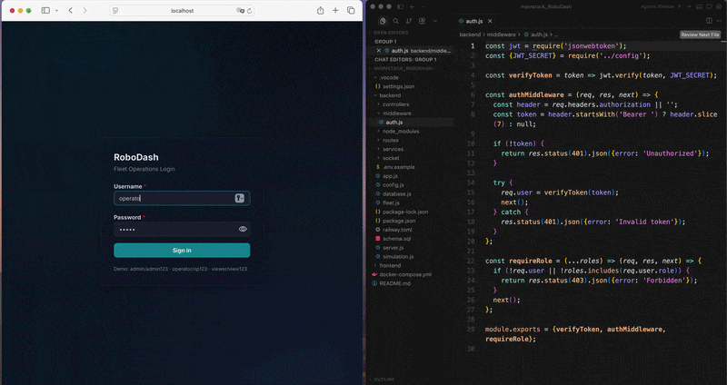
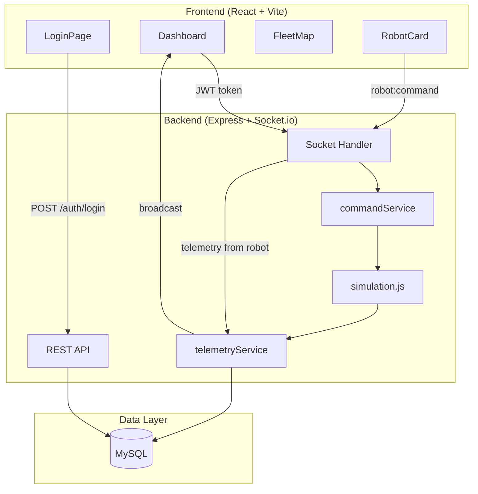
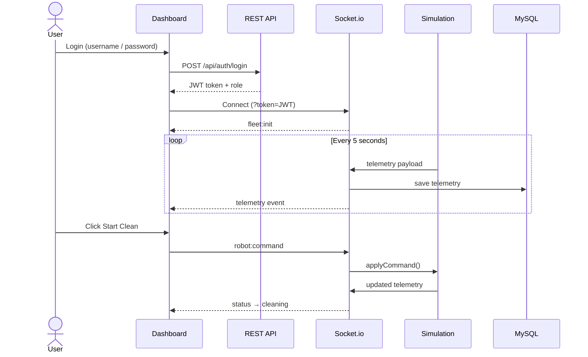
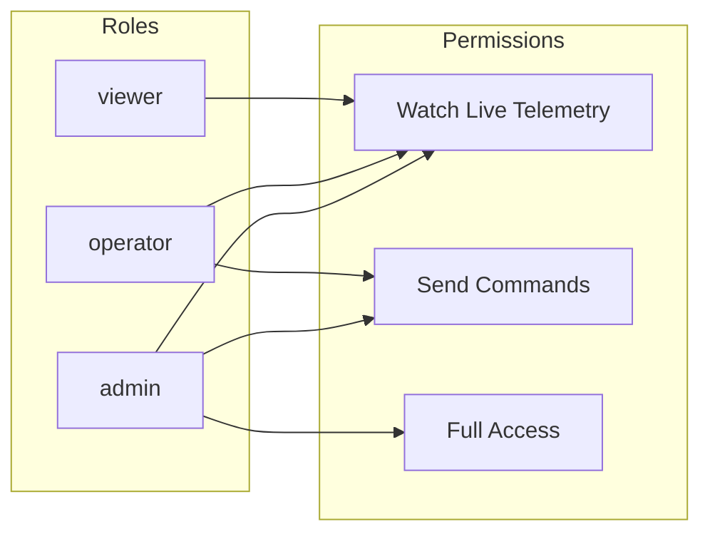
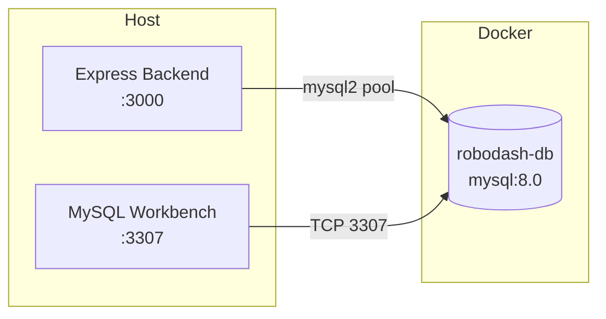
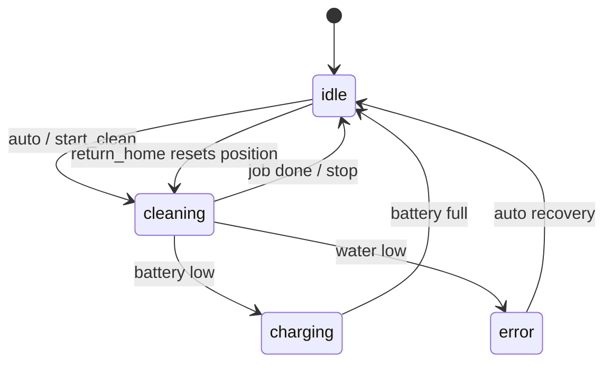
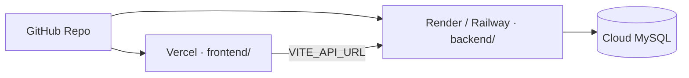

# RoboDash

[](https://github.com/yasin-erkan/ROBODASH)

**Real-time fleet operations dashboard for solar panel cleaning robots.**

Monitor 10 robots across Europe, send remote commands, and track system events — built as a full-stack MERN demo with JWT auth, role-based access, and WebSocket telemetry.

> **Note:** Personal domain-research project for robotics HMI / fleet operations (not a take-home assignment). Demonstrates telemetry, remote control, auth, and how a web dashboard would connect to ROS via `rosbridge_suite` in production.



---

## At a Glance

| | |
|---|---|
| **Stack** | React · Express · MySQL · Socket.io |
| **Robots** | 10 EU sites (LU, DE, FR, ES, IT, NL, BE, AT, PL, PT) |
| **Realtime** | WebSocket telemetry every 5s |
| **Auth** | JWT + RBAC (viewer / operator / admin) |
| **Simulator** | Built-in — no separate process needed |
| **Database** | MySQL 8 in Docker (`robodash-db`, port 3307) |
| **Tests** | Vitest — 8 unit tests (RBAC, telemetry, sim) |

---

## Architecture



---

## Data Flow



---

## Role-Based Access



| Role | Watch fleet | Start / Stop / Home | Notes |
|------|:-----------:|:-------------------:|-------|
| `viewer` | ✅ | ❌ | Read-only ops center |
| `operator` | ✅ | ✅ | Day-to-day fleet control |
| `admin` | ✅ | ✅ | Same as operator (demo) |

---

## Features

- **Live fleet map** — Leaflet dark-theme map with robot markers across Europe
- **Real-time telemetry** — battery, water level, panels cleaned, GPS, status
- **Remote commands** — `start_clean` · `stop` · `return_home`
- **State machine sim** — idle → cleaning → charging / error → idle
- **System logs** — connection events, status changes, commands
- **JWT authentication** — protected socket + REST command endpoints
- **Logout** — clear session, disconnect socket
- **Unit tests** — Vitest for command RBAC, telemetry normalize, sim state machine
- **Modular backend** — controllers · services · middleware · socket layer

---

## Project Structure

```
mernstack_RoboDash/
├── docker-compose.yml       # MySQL 8 container (robodash-db)
├── backend/
│   ├── server.js              # Entry point — starts API + sim
│   ├── app.js                 # Express setup
│   ├── simulation.js          # Built-in fleet simulator
│   ├── fleet.js               # 10 robot definitions
│   ├── database.js            # MySQL pool + queries
│   ├── schema.sql             # DB setup (fresh + migrate)
│   ├── config.js              # Env + demo users
│   ├── middleware/auth.js     # JWT verify + role guard
│   ├── controllers/           # HTTP handlers
│   ├── services/              # Business logic + *.test.mjs
│   ├── vitest.config.js       # Test runner config
│   ├── simulation.test.mjs  # Sim command tests
│   ├── socket/index.js        # WebSocket auth + events
│   └── routes/index.js        # API routes
│
└── frontend/
    └── src/
        ├── App.jsx            # Auth gate (login vs dashboard)
        ├── components/
        │   ├── LoginPage.jsx
        │   ├── Dashboard.jsx
        │   ├── FleetMap.jsx
        │   ├── RobotCard.jsx
        │   └── ...
        ├── hooks/
        │   ├── useAuth.js
        │   └── useFleetSocket.js
        └── lib/
            ├── auth.js
            └── socket.js
```

---

## MySQL + Docker

The project uses **MySQL 8** running in Docker. Backend connects on port **3307** (mapped from container `3306`).



### Docker Compose (recommended)

```bash
# Start MySQL
docker compose up -d

# Check status
docker ps
# → robodash-db   0.0.0.0:3307->3306/tcp
```

### Manual Docker (alternative)

```bash
docker run -d --name robodash-db \
  -e MYSQL_ROOT_PASSWORD=password123 \
  -e MYSQL_DATABASE=robodash \
  -p 3307:3306 \
  -v robodash_mysql_data:/var/lib/mysql \
  mysql:8.0
```

### Connection Details

| Setting | Value |
|---------|-------|
| Container | `robodash-db` |
| Image | `mysql:8.0` |
| Host port | `3307` |
| User | `root` |
| Password | `password123` |
| Database | `robodash` |

### Database Tables

| Table | Purpose |
|-------|---------|
| `robots` | Fleet registry — 10 EU robots |
| `telemetry_data` | Live telemetry snapshots (every sim tick) |
| `system_logs` | Connection events, status changes, commands |

### Schema Setup

```bash
cd backend
npm run db:setup
# password: password123
```

Or via MySQL Workbench / CLI:

```bash
mysql -u root -p -P 3307 -h 127.0.0.1 < backend/schema.sql
```

`schema.sql` handles both **fresh install** and **existing DB upgrade** (adds missing columns safely).

### Useful Docker Commands

```bash
docker compose up -d          # start DB
docker compose down           # stop DB
docker compose logs db        # view MySQL logs
docker exec -it robodash-db mysql -u root -ppassword123 robodash
```

---

## Quick Start

### Prerequisites

- Node.js 18+
- Docker Desktop (for MySQL)

### 1 · Database

```bash
docker compose up -d
cd backend && npm run db:setup
```

### 2 · Backend

```bash
cd backend
npm install
npm start
# → http://localhost:3000
```

### 3 · Frontend

```bash
cd frontend
npm install
npm run dev
# → http://localhost:5173
```

### Demo Accounts

| Username | Password | Role |
|----------|----------|------|
| `admin` | `admin123` | admin |
| `operator` | `op123` | operator |
| `viewer` | `view123` | viewer |

---

## API Reference

| Method | Endpoint | Auth | Description |
|--------|----------|------|-------------|
| `POST` | `/api/auth/login` | — | Get JWT token |
| `GET` | `/api/health` | — | Server + sim status |
| `GET` | `/api/fleet` | — | Robot registry |
| `GET` | `/api/telemetry-history` | — | Historical telemetry |
| `GET` | `/api/logs` | — | System logs |
| `POST` | `/api/robots/:id/command` | operator, admin | Send robot command |

**Command body:**
```json
{ "action": "start_clean" }
```
Actions: `start_clean` · `stop` · `return_home`

---

## WebSocket Events

| Direction | Event | Payload |
|-----------|-------|---------|
| Client → Server | `robot:command` | `{ robotId, action }` |
| Server → Client | `telemetry` | `{ id, battery, status, lat, lng, ... }` |
| Server → Client | `system:log` | `{ level, source, message, ... }` |
| Server → Client | `fleet:init` | `{ robots, countries }` |
| Server → Client | `command:ack` | `{ robotId, action, ok }` |

**Connect:** `io(url, { query: { token: JWT } })`

---

## Environment Variables

| Variable | Default | Description |
|----------|---------|-------------|
| `PORT` | `3000` | Backend port |
| `DB_HOST` | `127.0.0.1` | MySQL host |
| `DB_PORT` | `3307` | MySQL port |
| `DB_USER` | `root` | MySQL user |
| `DB_PASSWORD` | `password123` | MySQL password |
| `DB_NAME` | `robodash` | Database name |
| `JWT_SECRET` | `robodash-dev-secret` | JWT signing key |
| `ROBOT_TOKEN` | `robot-secret-key` | Real robot socket auth |
| `ENABLE_SIMULATOR` | `true` | Built-in sim on/off |
| `SIM_INTERVAL_MS` | `5000` | Sim tick interval |
| `FRONTEND_URL` | — | CORS + Socket.io origin (production) |
| `VITE_API_URL` | `http://localhost:3000` | Frontend → backend URL (Vercel) |
| `MYSQLHOST` etc. | — | Auto-read by `database.js` on Railway |

**Production:**
```bash
ENABLE_SIMULATOR=false npm run start:prod
```

---

## Robot Status State Machine



---

## Production Path

This repo is a **working HMI demo**. In production:

```
ROS Robot → rosbridge_suite → adapter → RoboDash Socket.io
```

- `simulation.js` is replaced by real robot telemetry
- `ENABLE_SIMULATOR=false` disables the built-in sim
- Same telemetry contract — dashboard code stays unchanged

---

## Tests (Vitest)

```bash
cd backend && npm test
# 8 tests · 3 files · ~1s
```

| File | Tests | Coverage |
|------|:-----:|----------|
| `commandService.test.mjs` | 3 | RBAC (viewer denied), operator commands, invalid actions |
| `telemetryService.test.mjs` | 2 | Telemetry normalize (`robot_id` → `id`, fleet fallback) |
| `simulation.test.mjs` | 3 | `start_clean`, `stop`, `return_home` state machine |

---

## Tech Stack

```
React 19 · Vite · Mantine · Leaflet
Express 5 · Socket.io · MySQL2 · JWT · Vitest
```

---

## Deploy to Production

Vercel alone cannot run this backend (WebSocket + MySQL). Use **two services**:



| Service | Host | Root dir |
|---------|------|----------|
| Frontend | [Vercel](https://vercel.com) | `frontend` |
| Backend | [Render](https://render.com) or Railway | `backend` |
| MySQL | TiDB Cloud / db4free / Docker | — |

### Backend (Render — free tier)

1. **New Web Service** → connect [yasin-erkan/ROBODASH](https://github.com/yasin-erkan/ROBODASH)
2. **Root Directory:** `backend`
3. **Build:** `npm install` · **Start:** `npm start`
4. Env: `JWT_SECRET`, `ENABLE_SIMULATOR=true`, + MySQL credentials
5. **Networking** → copy public URL
6. Run `schema.sql` once on your MySQL instance

`database.js` auto-reads `MYSQLHOST`, `MYSQLPORT`, etc. when deployed on Railway.

### Frontend (Vercel)

1. Import repo → **Root Directory:** `frontend`
2. Env: `VITE_API_URL=https://your-backend.onrender.com`
3. Deploy

### Link CORS

On backend, set `FRONTEND_URL` to your Vercel URL and redeploy.

---

## License

ISC — demo / portfolio project.
